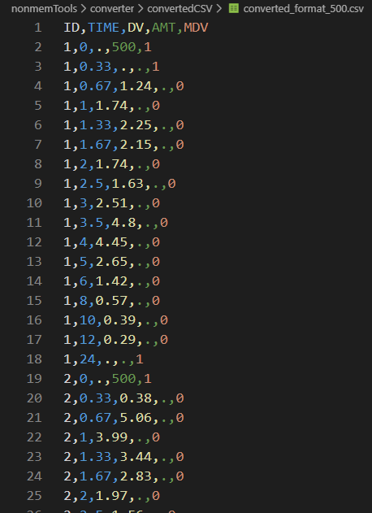

# memoming Tools

[1. nonmem CSV Converter](#nonmem-csv-converter)

----
### ToDo List

~~1. nonmem CSV to nonmemTran converter~~ (Done)

----
### 05-DEV-2019
## Nonmem CSV Converter
* 기존 제약보고서 내 Data 파일을  
  Nonmem에서 사용가능한 Data Format으로 변경 해주는 Converter.  [ [code 바로가기](nonmemTools/converter) ]
* ##### How To Use
  1. nonmemTools/converter/csvForms 내에 변환하고자 하는 CSV 파일들을 모아놓음.
  2. 해당 CSV 파일명의 확장자 바로전에 표기할 AMT의 양을 _으로 구분해서 표기.  ex) test_500.csv
  3. Converter.py 실행.
  4. 변환 하고자 하는 CSV의 포멧은 csvForms 안의 format.csv 참고.

<table>
<thead>
  <tr>
  <th align="center"> Origin Data </th>
  <th align="center"> Converted CSV </th>
  </tr>
</thead>
<tbody>
    <tr>
        <td align="center">
        
        </td>
        <td align="center">
        
        </td>
    </tr>
  </tbody>
</table>

----
### 04-DEC-2019
* CSV To nmTran Converter 작업
----